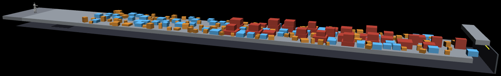

# Humanoid Box Scramble



*Course render (seed 495117, v0.1.6) — robot at the start, difficulty rising toward the far end.*

An Apex competition (Bittensor Subnet 1). Fork of
[Humanoid Parkour](https://github.com/macrocosm-os/apex-competition-humanoid-parkour). Miners
submit an **ONNX policy** that drives a Unitree G1 humanoid across a 48 m x 6 m room scattered
with a per-round-sampled field of 196 loose boxes: light clutter to weave through, crates light
enough to shove *and* to pick up and stack, and piles too heavy and too tall to step onto
directly. The finish is 1.6 m up, so the crossing has to end in a climb or a leap.

| | |
|---|---|
| id / version | `humanoid_box_scramble` 0.1.6 |
| robot | Unitree G1, **22 actuated DoF** — 12 legs + 10 arms (shoulder pitch/roll/yaw, elbow, wrist roll, per side), 38.2 kg |
| submission | ONNX graph, ≤ 15 MB, architecture free |
| interface | `obs[136]` + `state_in[256]` → `action[22]` + `state_out[256]`, float32 |
| evaluation | 12 instances × ≤ 2000 control steps, 700 s suite budget, 500 ms per `/act` — the round input, which lives in the competition row, not in `spec.yaml` |
| control | 50 Hz control on 500 Hz physics, PD position targets |
| history | `box_scramble_history/3` — robot pose plus every box that moved; `env/history.py` is the reader |
| baseline | `defaults.baseline_raw_score: 0.0` — still a placeholder, not a measurement (see Status) |

The interface is **not** upstream parkour's. This robot has full arm control because pushing,
lifting and climbing are the task, where parkour's was legs-only at 12 DoF; the observation grew
with it. A submission built for upstream, or for this course before 2026-08-18, fails the shape
check at load and is rejected as a typed submission failure rather than silently truncated.

## The room

48 m long, 6 m wide. West to east:

| Zone | Extent | Boxes | Forces |
|---|---|---|---|
| start apron | 0 – 8 m | 0 | settle into gait |
| mixed field (scramble + push interleaved) | 8 – 45 m | 100 scramble / 60 push | weaving, shoving, and carrying — both roles are spread across the whole field, not confined to sub-zones |
| climb zone (second half only) | 24 – 45 m | 36 | multi-mount climb, 1–2 tiers per pile, tops above the single-leg step-up ceiling |
| dash approach | 45 – 47 m | — | short sprint, then pick a route up |
| leap chain | 42.7 – 47.0 m | 3 fixed beams | 0.90 m tops, 1.05 m edge-to-edge gaps, on the centreline |
| finish platform | 47 – 48 m | — | **1.6 m above the floor** — completion needs height, not just reaching x = 48 m |

**199 boxes every round**: 196 sampled (100/60/36 by role) plus the 3 fixed leap beams. The count
and the role split are deterministic; what the round seed draws is each box's size, density, grip
and placement. A rejection-sampling pass against a shared footprint registry keeps them from
spawning interpenetrating. The count is fixed rather than sampled so that a round's difficulty is
stable and a score reflects the policy, not the luck of the draw.

Boxes are free bodies with mass derived from sampled density, so pushing, lifting and climbing are
contact-solver outcomes, not scripted animations. Measured over 20 seeds:

| Zone | Side (m) | Height (m) | Density (kg/m³) | Mass (kg) |
|---|---|---|---|---|
| scramble | 0.28 – 0.85 | 0.22 – 0.60 | 60 – 390 | 1.1 – 102 |
| **push** | **0.55 – 0.95** | **0.30 – 0.45** | **18 – 45** | **1.7 – 18.0** |
| climb (per tier) | 0.60 – 1.95 | 0.39 – 0.79 | 526 – 2097 | 141 – 2730 |
| leap beam (fixed, ×3) | 0.84 × 0.50 | 0.90 top | 1313 | 496 each |

Push crates are the building block (changed 2026-09-14). They used to be shove-only; they are now
sized and lightened so a policy can lift one and set it on another — about 0.40 m tall, so four
stack the full 1.6 m. Climb piles remain immovable by design: they are footing, not cargo.

```bash
python -m env.course --seed 1     # print one round's box layout
python tools/preview.py --seed 1  # stills + flythrough (needs mujoco + ffmpeg)
```

## Friction

Every sampled box draws its own **grip, mu 0.40 – 0.85, independently of density** (changed
2026-09-14; the three fixed leap beams sit at 0.625). Grip is a surface property and mass is a bulk
one, and deriving one from the other tied them together backwards: the crates light enough to lift
were also the most slippery. The floor is 0.90, so a crate is still the worse surface to stand on.

The robot has no fingers — a five-joint arm ending in a fused hand — so a crate is held by pinching
it between two palms. The 0.40 floor is what that pinch needs to hold a median crate at arm's
length; the top of the band is good footing for a climb.

Declared friction reaches the contact solver via `geom_priority` on the room and crate geoms.
MuJoCo mixes friction as the element-wise **maximum** at equal priority, and the G1 model declares
none, so without this every foot contact solved at the robot's 1.0 default and every mu this course
drew was discarded. That was inert in 0.1.0–0.1.2 and is gated in release CI now.

## Scoring

| Outcome | Score |
|---|---|
| completed | `1.0 + (max_steps - steps) / max_steps` → (1.0, 2.0] |
| fell / timeout / out_of_bounds / time_limit | `progress`, the fraction of the room crossed → [0.0, 1.0) |
| physics_glitch / invalid action / player error | 0.0 |

`raw_score` is the mean over the instances. Progress is continuous along the room regardless of
zone, so a policy that gets 2 m further into the field scores 2 m better even without clearing it.

An instance runs under two limits: the step cap (`max_steps_per_episode`) and the suite's
wall-clock budget (`time_budget_s`, shared equally across the instances still to run). Answering
each `/act` well inside `deadline_ms` is part of the task, not just a limit on it.

`time_limit` is scored on the progress the run made, not zeroed (changed 2026-09-08). It is the one
terminal reason a submission does not cause — the referee's clock ran out, which depends on what
else was sharing the machine. Zeroing it let contention decide the score and hit the best runs
hardest, since a policy that survives longer is the one that eats the clock.

## What varies per round, and what does not

The room's *shape* — dimensions, zone lengths, box count and roles — is fixed across every round.
The field's instantiation is not: every box's size, density, grip, yaw and position, plus each
instance's wind, comes from one per-round seed (`env/course.sample_boxes`). Within a round every
instance faces the identical field and only wind varies, so the same submission scores the same.
This is upstream's friction/wind randomisation applied one level up.

## Perception

Proprioception, pose on the track, a height scan (9×5 grid, 0.4 m behind to 1.6 m ahead), overhead
and forward clearance (7 samples), and one proximity ray per hand. The scan reports whatever is
directly below each ray — floor or box top, whichever is higher — with no "this is a box" or "this
is zone X" channel, and no box manifest. A stack reads as a tall step; a scramble cluster reads as
broken, closely-spaced bumps. Wind and box contact state are unobservable, which is what the
256-wide recurrent state is for.

## Status

**Released and running on staging, not yet on production.**

- v0.1.6 is built, cosign-signed and pinned by digest in `spec.yaml`; release CI gates actuator
  pairing, box-field disjointness, round reproducibility, replay round-trip, friction reaching the
  solver, history compaction, and response handling.
- Active on the `stage` and `pr` registry pointers. Production runs an allowlist
  (`SPEC_DRIVEN_EVAL`) that does not yet include `humanoid_box_scramble`, so a prod activation
  needs that list updated first.
- Sizing is measured, not inherited: 12 × 2000 at `time_budget_s` 700 fits with headroom (478 s
  for a full 12-instance suite on staging). The 24 × 3000 inherited from upstream did not.

Open before it can be treated as calibrated:

1. **The course is not proven solvable.** Zero completions across ~3,800 instances; the furthest
   any policy has reached is 19.9 m of 48 m. 0.1.6 opened both routes up — stackable push crates
   and a wider, lower leap beam — but neither has been shown to work end to end.
2. `defaults.baseline_raw_score` is 0.0, a placeholder. `baseline/PROVENANCE.md` still describes
   the pre-2026-08-18 104-d/12-d interface and needs re-running at 22 DoF.
3. Arm PD gains are reasoned from the model's torque limits, not tuned against a trained policy.
4. History is ~49 MB per submission and grows with how long a policy survives — re-check it before
   raising `max_steps_per_episode`.

## Repo layout

```
env/            room + box-field sampling, physics, perception, gates, scoring, history format
  course.py     the room and box field, sampled per round
  sim.py        round-scoped scene compilation, box-aware ray casts, termination gates
  scoring.py    instance -> score
  history.py    box_scramble_history/3 — robot qpos plus only the boxes that moved
  assets/       vendored Unitree G1 22-DoF model + collision meshes (BSD-3)
player/         ONNX serving + interface validation (player image)
referee/        match driver over gym_v1 (referee image)
baseline/       baseline.onnx + PROVENANCE.md — predates the 22-DoF interface, see Status
tools/          preview, replay, local eval, course-layout export, policy builders
docs/           course-layout.json — the room shell for a renderer (the box field is per-round)
.github/        release workflow and its physics/format gates
spec.yaml       the competition manifest
```

## Provenance

Built as a fork of
[macrocosm-os/apex-competition-humanoid-parkour](https://github.com/macrocosm-os/apex-competition-humanoid-parkour),
itself built from
[apex-competition-hello-world](https://github.com/macrocosm-os/apex-competition-hello-world). The
robot model, `gym_v1` vendoring, player serving logic, and scoring formula are carried over; the
room, box field, and their sampling/physics are new.
